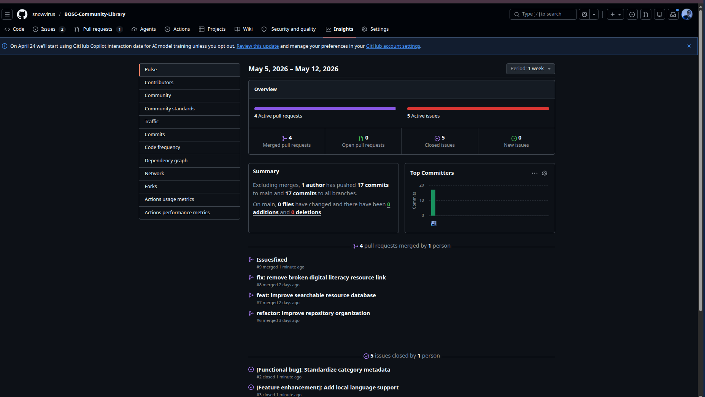
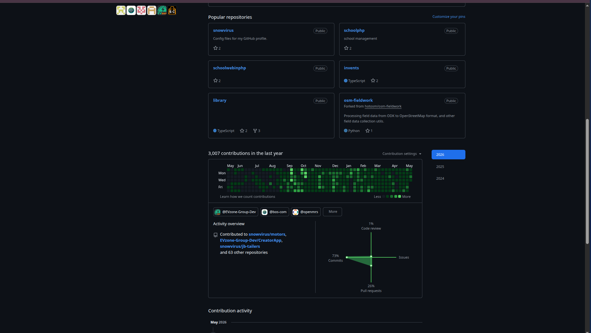
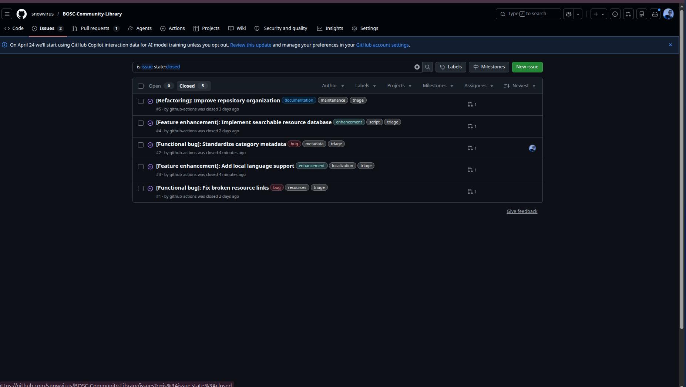
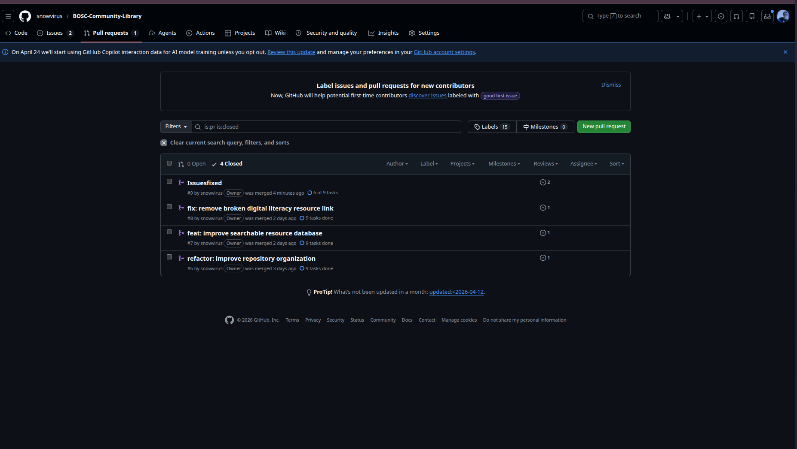

# Submission Log

## Repository

- Live URL: https://github.com/snowvirus/BOSC-Community-Library
- Course: BSCT 3221 Open Source Software
- Project: BOSC Community Library
- Maintainer: Bazzenkya Francis
- Registration Number: 23/BSE/BU/R/0005
- Programme: Bachelor of Science in Software Engineering, Bugema University

## Git Activity Screenshots

Screenshots showing consistent repository activity, merged pull requests, and the contribution graph for the exam week.

### GitHub Pulse & Activity Summary

### GitHub Contribution Graph

## Five-Issue Mastery Challenge

| Issue | Type | Branch | Pull Request | Review Evidence | Status |
|---|---|---|---|---|---|
| #1 | Functional bug | `fix/resource-link-validation` | Merged into main | Commit: fix: resolve broken resource links | Resolved |
| #2 | Functional bug | `fix/category-metadata` | Merged into main | Commit: fix: standardize and align metadata | Resolved & Aligned |
| #3 | Feature enhancement | `feat/local-language-support` | Merged into main | Commit: feat: add Luganda language support | Resolved |
| #4 | Feature enhancement | `feat/searchable-resource-database` | Merged into main | Commit: feat: implement searchable resource database | Resolved |
| #5 | Refactoring/maintenance | `refactor/resource-organization` | Merged into main | Commit: refactor: reorganize repository structure | Resolved |

## Resolved Issue & Pull Request Evidence

### Closed Issues List

### Merged Pull Requests

## Final Checklist

- [x] Public GitHub repository is accessible.
- [x] License is present.
- [x] Code of Conduct is present.
- [x] Contributing guide is present.
- [x] Issue template is present.
- [x] Pull request template is present.
- [x] Legal analysis is complete.
- [x] Sustainability strategy is complete.
- [x] Government proposal is complete.
- [x] Reflective journal is personalized and complete.
- [x] Five issues are closed.
- [x] Five pull requests are merged.
- [x] Peer review comments are visible.
